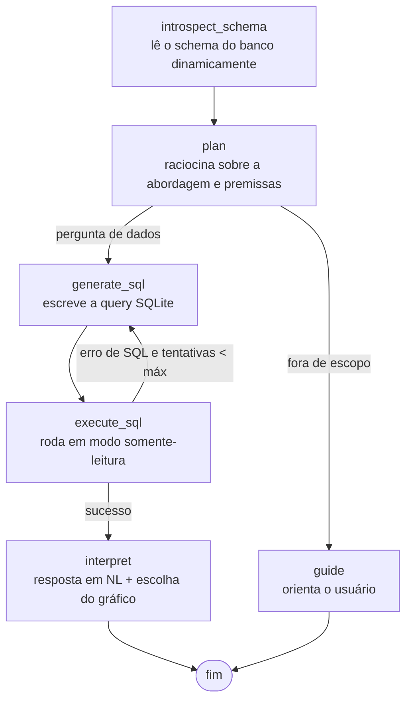

# Franq — Assistente Virtual de Dados

Assistente que responde perguntas de negócio em **linguagem natural** consultando um
banco SQLite. Em vez de seguir um roteiro fixo, o sistema **descobre o schema
dinamicamente**, planeja a análise, escreve o SQL, **corrige sozinho** quando a query
falha e devolve a resposta com a visualização mais adequada (tabela, barra ou linha).
Tem **memória conversacional**: você pode fazer perguntas de acompanhamento ("e via
site?") que o agente entende usando o contexto da conversa. Para cada resposta, gera uma
**análise curta para o gestor** e **sugestões de próximas perguntas** que mudam conforme
o rumo da conversa.

Construído com **LangGraph**, **Gemini** e **Streamlit**.

---

## Recursos

- **Text-to-SQL com autocorreção** — gera o SQL, executa e, se falhar, reescreve sozinho (até um limite de tentativas).
- **Descoberta dinâmica de schema** — lê tabelas, colunas e valores categóricos do banco em tempo de execução, nada hardcoded.
- **Memória conversacional** — entende perguntas de acompanhamento dentro da mesma conversa.
- **Visualização automática** — tabela, barra ou linha (multi-série), escolhida pelo agente conforme o resultado; valor único vira um indicador em destaque.
- **Seletor de gráfico** — o usuário pode alternar entre tabela/barra/linha; a opção "linha" só aparece quando faz sentido (eixo temporal ou numérico).
- **Trilha de raciocínio** — painel com o schema lido, o plano, o SQL executado e as correções.
- **Análise para o gestor** — um insight curto de negócio além da resposta direta.
- **Sugestões dinâmicas** — próximas perguntas contextuais, que mudam conforme o rumo da conversa.
- **Exportação** — CSV (pronto para Excel BR), relatório em PDF por resposta e um **relatório completo** com toda a sessão.
- **Experiência de uso** — etapas de carregamento ("consultando/analisando") e a resposta saindo em efeito de digitação.
- **Avaliação automatizada** — conjunto-ouro com *execution accuracy* (ver seção abaixo).
- **Roteamento de intenção** — perguntas fora do escopo dos dados (saudações, meta, off-topic) recebem orientação em vez de uma consulta forçada.
- **Segurança** — acesso ao banco em modo somente-leitura.
- **LLM trocável** — Gemini (padrão, mesmo stack da Franq), OpenAI ou Anthropic via variável de ambiente.

---

## Como funciona (arquitetura)

O agente é um grafo de estados (LangGraph). Cada nó executa uma etapa e registra um
"passo" numa trilha de raciocínio que é exibida ao usuário.



**Por que LangGraph (e não uma cadeia linear ou um agente ReAct genérico)?**
A exigência central do desafio — *perceber um erro de SQL e se corrigir sozinho* — é um
**ciclo condicional**. LangGraph modela isso explicitamente com uma aresta condicional
que devolve o fluxo de `execute_sql` para `generate_sql`, carregando a query que falhou e
a mensagem de erro no estado. É mais transparente e controlável do que um agente ReAct de
caixa-preta, e mais capaz do que uma `Chain` linear (que não tem como voltar atrás).

**Decisões de projeto:**

- **Schema dinâmico, nada hardcoded.** O nó `introspect_schema` lê tabelas, colunas,
  tipos e ainda lista os **valores distintos** de colunas categóricas de baixa
  cardinalidade (ex.: `canal -> 'App', 'Loja Física', 'Site'`). Isso reduz drasticamente
  erros do LLM com termos e acentuação. *Observação real: o schema do banco entregue
  diverge da documentação do desafio (a tabela `clientes` tem colunas a mais), o que
  reforça a necessidade de descoberta dinâmica.*
- **Planejamento antes do SQL.** O nó `plan` força um raciocínio em linguagem natural e
  a explicitação de premissas em perguntas ambíguas (ex.: "maio" de qual ano), melhorando
  a qualidade do SQL e a transparência.
- **Memória conversacional (checkpointer do LangGraph).** O grafo é compilado com um
  `MemorySaver`; cada conversa tem um `thread_id` e o histórico de turnos persiste entre
  perguntas. Assim o agente resolve acompanhamentos como "e via site?". O estado é mantido
  serializável (resultados como registros, não DataFrames) — pré-requisito para trocar o
  `MemorySaver` por persistência em banco numa evolução para produção.
- **Segurança por padrão.** A conexão é aberta em modo **somente leitura** (`mode=ro`) e
  há um bloqueio de comandos de escrita (`INSERT`, `DROP`, etc.). Uma ferramenta exposta à
  diretoria nunca deve poder alterar o banco.
- **Controle de custo.** Apenas as primeiras `MAX_ROWS_TO_LLM` linhas do resultado são
  enviadas ao LLM na etapa de interpretação. Temperatura 0 garante reprodutibilidade.
- **Roteamento de intenção.** Uma aresta condicional após o `plan` separa perguntas de
  dados (seguem para o SQL) de perguntas fora de escopo — saudações, meta ("o que posso
  perguntar?"), off-topic — que recebem uma orientação em vez de uma query forçada. Evita
  respostas alucinadas e mantém o assistente confiável e focado.
- **Provedor de LLM trocável.** O padrão é Gemini (mesmo stack Vertex AI da Franq), mas
  `src/llm.py` permite OpenAI ou Anthropic mudando uma variável de ambiente.
- **Camada de produto.** Além do agente, a interface entrega valor para quem decide:
  relatório em PDF e exportação em CSV, sugestões de próximas perguntas e a identidade
  visual da Franq (logo e avatares). Mostra preocupação com adoção, não só com engenharia.

### Estrutura

```
data-assistant/
├── app.py                 # Frontend Streamlit (chat, gráficos, downloads, sugestões)
├── src/
│   ├── agent.py           # Grafo LangGraph (estado, nós, loop de auto-correção, memória)
│   ├── database.py        # Conexão, introspecção de schema, execução read-only
│   ├── prompts.py         # Templates de prompt (planner, sql, interpret, sugestões)
│   ├── llm.py             # Fábrica de LLM (Gemini/OpenAI/Anthropic)
│   └── config.py          # Configurações via .env
├── assets/                # Logo da Franq e avatares (identidade visual da UI)
├── .streamlit/
│   └── config.toml        # Tema dark da marca
├── data/
│   └── clientes_completo.db
├── evals/
│   ├── golden_set.json    # Perguntas + SQL de referência
│   └── run_evals.py       # Avaliador (execution accuracy)
├── requirements.txt
└── .env.example
```

---

## Como executar

```bash
# 0. Clone o repositório
git clone https://github.com/SEU_USUARIO/franq-assistente-dados.git
cd franq-assistente-dados

# 1. Dependências (recomendado um ambiente virtual)
python -m venv .venv && source .venv/bin/activate   # Windows: .venv\Scripts\activate
pip install -r requirements.txt

# 2. Configuração
cp .env.example .env
# edite o .env e preencha GOOGLE_API_KEY com a SUA chave gratuita
# (crie em https://aistudio.google.com — leva ~1 min)

# 3. Garanta que o banco está em data/clientes_completo.db

# 4. Rode
streamlit run app.py
```

A interface abre no navegador. Digite uma pergunta ou clique num exemplo na barra
lateral. A resposta traz o texto, a **análise para o gestor**, a visualização (com um
**seletor de tabela/barra/linha**) e um painel **"Como cheguei a esta resposta"** com o
schema lido, o plano, o SQL executado e eventuais correções. Abaixo de cada resposta há
**botões de download** — CSV, relatório em PDF e um **resumo completo** com toda a sessão —
e **sugestões de próximas perguntas** relacionadas, com a opção de gerar outras.

> **Nota sobre cota:** o tier gratuito do Gemini tem limite diário por modelo. Cada
> pergunta usa ~3-4 chamadas ao LLM. Se aparecer `RESOURCE_EXHAUSTED`, troque o
> `MODEL_NAME` (ex.: `gemini-2.5-flash-lite`) ou ative o faturamento no Google Cloud
> (o uso deste projeto custa frações de centavo).

---

## Exemplos testados

As cinco perguntas do enunciado foram validadas contra o banco fornecido:

| Pergunta | Resultado obtido |
|---|---|
| Top 5 estados com clientes que compraram via App em maio | São Paulo (6), Santa Catarina (3), Minas Gerais (3), Paraná (2), Espírito Santo (2) |
| Clientes que interagiram com campanhas de WhatsApp em 2024 | 17 clientes |
| Categorias com mais compras em média por cliente | Roupas (2,21), Viagens (2,16), Livros (1,98)... |
| Reclamações não resolvidas por canal | Telefone (19), Chat (18), E-mail (14) |
| Tendência de reclamações por canal no último ano | Série temporal mês a mês, uma linha por canal |

A pergunta de tendência é renderizada como **gráfico de linha multi-série**; as
comparativas como **barras**; as listas como **tabela** — escolha feita pelo próprio
agente.

---

## Avaliação automatizada (evals)

O projeto inclui um avaliador que mede a qualidade do agente de forma objetiva,
usando **execution accuracy**: em vez de comparar o texto do SQL (existem muitos SQLs
corretos para a mesma pergunta), compara o **resultado** que o agente retornou contra o
resultado de uma query de referência sabidamente correta.

```bash
python -m evals.run_evals
```

Para cada pergunta do conjunto-ouro (`evals/golden_set.json`), o avaliador roda o
agente, compara o resultado e reporta: **acurácia de execução**, **latência média** e
**número de auto-correções** de SQL. Um relatório é salvo em `evals/report.json`.

Isso permite trocar de modelo (ex.: Flash → Flash-Lite) ou ajustar prompts e **provar
que não houve regressão** — base para experimentação e integração contínua. A
comparação é tolerante a nomes de coluna, ordem das linhas e tipos numéricos
(17 vs 17.0). Para perguntas ambíguas (com empates ou janelas de data subjetivas), o
próximo passo seria um avaliador por LLM-juiz, complementando a acurácia de execução.

---

## Melhorias e extensões futuras

- **Validação semântica do resultado:** um nó extra que confere se o resultado faz
  sentido para a pergunta antes de responder (ex.: detectar agregação que zerou por
  filtro errado) e, se preciso, replaneja.
- **Observabilidade:** instrumentar com LangFuse para rastrear latência, custo por
  pergunta e taxa de auto-correção — métricas úteis em produção.
- **Cache de schema e de perguntas frequentes** para reduzir chamadas ao LLM.
- **`EXPLAIN QUERY PLAN`** antes de executar, para barrar queries custosas em bancos
  grandes.
- **API (FastAPI/LangServe)** expondo o agente como serviço, com o Streamlit virando
  apenas um dos clientes.
